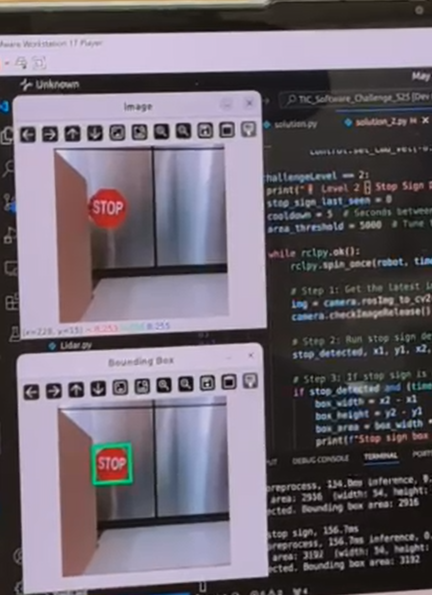

# Toyota Software Innovation Challenge

## Project Overview

This repository showcases the software solution developed for the Toyota Innovation Challenge, which focused on creating an autonomous navigation system for Automated Guided Vehicles (AGVs). Utilizing ROS 2, the team developed an intelligent control system capable of safely and efficiently moving vehicle components within a simulated factory environment. There was an emphasis on automation, computer vision recognition, and collision avoidance.

## Background

The goal was to address the real-world challenge of automating vehicle part transportation in manufacturing settings by applying software for robotics. Over 2 days, we were challenged to innovate and come up with unique solutions. The team focused on autonomous navigation and computer vision recognition with the hardware provided by the hosts.

The solution integrated:

- ROS 2 for robot software architecture
- LiDAR for obstacle detection and collision avoidance
- Computer vision (YOLOv8) for image recognition
- IMU sensor for directional navigation and accurate turning

## Technologies Used

The solution was developed using ROS 2 Foxy Fitzroy as the core software framework and implemented in Python 3. It integrated several key technologies to enable autonomous robot navigation and interaction:

- LiDAR for real-time obstacle detection and collision avoidance
- Ultralytics YOLOv8 for computer vision and visual object recognition
- IMU sensor for sensor-based navigation, providing directional awareness and enabling accurate turns
- Gazebo simulation for initial testing and development
- TurtleBot3 for real-world implementation and validation

## Media

[Video: Stop sign Image recognition](https://drive.google.com/file/d/1iyR9DpQCuiBYvXAoetEY2VPKTsodWzcp/view?usp=drive_link)

[Video: Full Autonomous Driving](https://drive.google.com/file/d/1TUBsWQnf_FG1uMiiiPaejTno2OFhLpOd/view?usp=drive_link)

## Challenge Levels Completed

| Level | Description                                           | Status           |
|:-----:|-------------------------------------------------------|:----------------:|
|   0   | Basic keyboard control of the robot                   | ✅ Completed     |
|   1   | Keyboard control with LiDAR-based collision detection | ✅ Completed     |
|   2   | Stop sign detection and response with YOLOv8          | ✅ Completed     |
|   3   | Fully autonomous navigation and obstacle avoidance    | ✅ Completed     |
|  3.5  | Trailer attachment navigation                         | ❌ Not attempted |
|   4   | Single dynamic obstacle avoidance                     | ❌ Not attempted |
|   5   | Dynamic obstacle avoidance                            | ❌ Not attempted |

## Results

| Challenge | Testing Environment        | Fastest Delivery Time   |
|:---------:|----------------------------|:------------------------:|
| Level 3   | Simulation & Real Robot    | 45.4 seconds            |

(Consider adding demo visuals like GIFs or screenshots here to enhance understanding.)

Key Functional Highlights

✅ LiDAR-driven collision prevention system

✅ Real-time YOLO-based stop sign detection

✅ Fully autonomous pathfinding and obstacle negotiation

🔄 Modular software design for extensibility and maintainability

## Usage Notice

This project was developed specifically for TMMC's robotics hardware and simulation environments. While not directly runnable without the provided hardware and frameworks.

## Resources

[TMMC Innovation Challenge Rubric](https://docs.google.com/document/d/1flLGNcA9dS5VKF4ATxY-NsXwTKZSBHlw/edit?tab=t.0)
[Starter Repository](https://github.com/IdeasClinicUWaterloo/TIC_Software_Challenge_S25)
[Slideshow Presentaion](https://docs.google.com/presentation/d/1sgjv9PdRfgcOw3ABQP494Ea3XXS_0NIl57ddAguurng/edit?usp=sharing)

## Author

Jayden Mangaroo, Mechatronics Engineering, University of Waterloo
🔗[LinkedIn](www.linkedin.com/in/jayden-mangaroo)
🧠 Interests: AI, Robotics, Automation, Product Development

